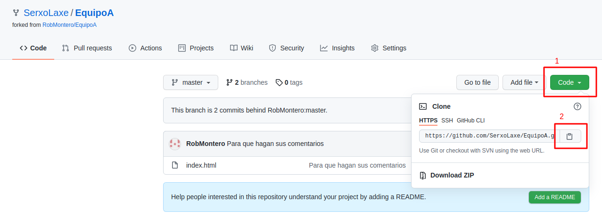
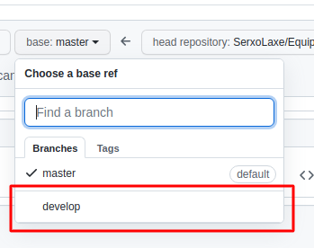
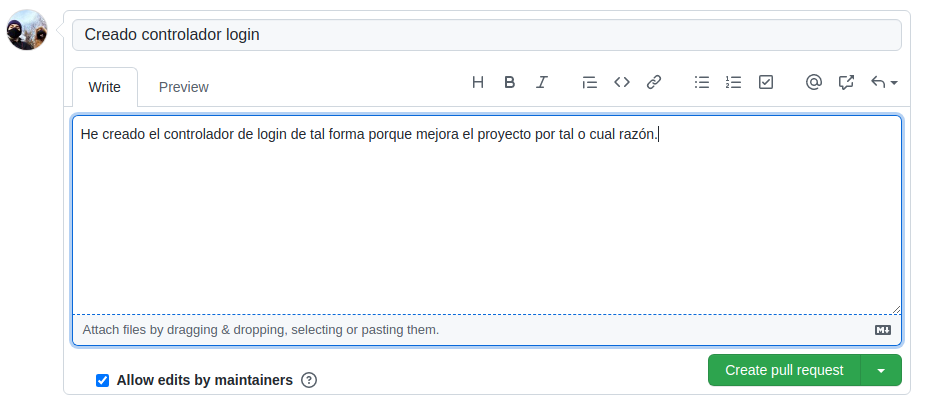

# Cómo colaborar en Github 🤝

Primero de todo hay que tener claro qué es Github y ,aún más importante, saber qué es git.
Después de llevar ya unos meses usando git y otras plataformas basadas en su uso, como son gitlab o github, quizás uno se pueda formar una intuición de cúal es su cometido y relevancia actual. Pero para acceder al uso de funcionalidades más avanzadas que realizar commits cuando cuadra creo que biene muy bien saber por qué y para qué existen git y sus plataformas web más relevantes.

Si quieres saltarte la introducción [estos son los pasos uno a uno para colaborar en este proyecto](#Vale,-pero-qué-tengo-que-hacer-_EXACTAMENTE_-?-😠)

## Qué es Git ? 🤔

Git es un software de control de versiones desarrollado por Linus Torvalds y sirve para desarrollar software de manera ordenada y colaborativa. Git permite registrar los cambios que hacemos a nuestro código y documentar cada uno de los pasos que tomamos, también permite deshacer cambios, añadir los realizados por otros y estructurar nuestro trabajo en diferentes ramas, que facilitan crear y mantener software.

Existen otras herramientas de control de versiones, como subversion o Azure DevOps Server, que también gozan de popularidad, pero la herramienta líder y estandar actual es git, que gracias a su uso masivo en el desarrollo de software para entornos Linux y la presencia de Github, la mayor plataforma web de compartición de código del mundo, se ha puesto a la cabeza cómo controlador de versiones preferido.

Git es una herramienta local, es decir, que está almacenada en nuestro ordenador, y que es normalmente usada desde el terminal, aunque existen herramientas GUI como algunos IDES, gitKraken o gitGui que disponen de interfaces de usuario y automatizaciones más complejas. Estas son totalmente prescindibles, ya que el terminal nos ofrece las mismas funcionalidades que ellas.

## Qué es Github ? 🤔

Github es una plataforma web de compartición de repositorios Git. Es una especie de red social de desarrolladores, donde estos pueden almacenar y compartir su código abierto a la vista y alcance del resto de desarrolladores. En Git es posible colaborar en proyectos ajenos usando las funcionalidades que ofrece git, pero impulsadas por las posibilidades que ofrece github con su presencia en la nube.

***
## Muy bien, pero qué hago para colaborar en el proyecto? 💢

Sólo hay que seguir unos pocos pasos y comprender unos pocos conceptos. Lo primero es entender que no existe una única manera de colaborar y crear en Github. Existen múltiples flujos de desarrollo, llamados workflows, y cada uno tiene sus pros y sus contras. El más universal es el **gitFlow**, que consiste en una serie de prácticas.
La primera es dividir el repositorio en una serie de ramas concretas en determinados contextos, cada una con su cometido. La rama master, que es la creada por defecto en un repositorio cuando este se inicia con el comando git init, se reserva para lanzamientos oficiales, es decir, en ella sólo debe estar presente la aplicación terminada.
La rama master debe ser ramificada nada más comenzar el desarrollo creando la rama develop, o dev para abreviar, dónde se almacenará la aplicación en estado de desarrollo. Esta rama se deberá branchear cada vez que se desarrolle una característica nueva, como por ejemplo al desarrollar una nueva interfaz de usuario en una aplicación web, para facilitar la búsqueda de bugs y evitar conflictos al realizar el merge al finalizar la característica. Cuando la característica es finalizada esta se añade a la rama develop.


***

## Vale, pero qué tengo que hacer _EXACTAMENTE_ ? 😠

#### 1. Forkear el repositorio

Lo primero es realizar un fork del repositorio en el que piensas colaborar, en este caso sería visitando [el repositorio del proyecto final](https://github.com/SerxoLaxe/proyectoHAB) y clicando en el botón de fork.


Después de esto ya tendremos el reposiorio forkeado en nuestro propio listado de repositorios y bajo nuestra propiedad, por lo que podremos subir cambios a él.
En la siguiente imagen se puede ver un ejemplo de un fork realizado por mí del repositorio Equipo A, hospedado por Robber en su propia cuenta. En vuestro caso el título del repositorio sería tuNombreDeUsuario/proyectoHAB (forked from SerxoLaxe/proyectoHAB)


#### 2. Clonar el repositorio

Ahora para poder realizar cambios en este repositorio debemos crear una copia localmente, es decir, descargar el repositorio en nuestro PC y empezar a trabajar en él. Para esto hay que copiar la dirección de nuestro fork e introducirla en el terminal local de git usando el comando git clone. Para esto primero clicamos sobre el botón de code (1) seguido del botón de copiar dirección https (2)



Una vez copiada la dirección lo siguiente es abrir el terminal (Ctrl + Alt +  T) y situarnos en el directorio donde deseamos situar nuestro repositorio, en mi caso lo haré en la carpeta reposClonados. Una vez allí ejecutamos el siguiente comando, cambiando la dirección url por la copiada anteriormente:
```sh
git clone https://github.com/SerxoLaxe/EquipoA.git
```


Con este comando ya tendremos una copia local del fork en nuestro PC. En la siguiente imagen se puede comprobar que hemos creado el directorio EquipoA, que es nuestro repositorio.


#### 3. Configurar el remoto upstream

Una vez clonado el fork debemos añadir a la lista de remotos el upstream, que es el repositorio original que hemos copiado y del que debemos depender a la hora de actualizar el propio. Cada vez que nos pongamos a trabajar en un fork debemos actualizarlo según los cambios que acontecen en el original. Sería muy poco práctico ponerse a trabajar en una funcionalidad para luego descubrir que ya estaba realizada por otro compañero, o que es incompatible con la versión de desarrollo actual. Por esto es importante añadir el remoto upstream y acostumbrarse a realizar un pull de este y un push a nuestro fork hospedado en Github al comenzar cada sesión de trabajo.

Lo primero es listar los remotos del repositorio. Para esto accedemos al directorio y ejecutamos el siguiente comando:

```sh
git remote -v
```


Como se puede ver en la imagen el clon de nuestro fork posee por defecto un único remoto, origin, que referencia el fork que hospedamos en nuestra cuenta. Si realizasemos un pull ahora no haríamos otra cosa que descargar los cambios de nuestro propio repositorio, pero eso no nos interesa, debemos actualizarnos tomando de referencia el repositorio original dónde nuestros compañeros están colaborando. Para esto añadimos el remoto **upstream** copiando la dirección https de este, tal y como hicimos en el punto 2 pero situándonos en el repositorio original, hospedado bajo el nombre de RobMontero.

```sh
git remote add upstream url-del-repositorio-que-forkeamos
```


Si volvemos a listar los remotos del repositorio como hicimos anteriormente ahora veremos el remoto **upstream** que acabamos de añadir.


Con esto ya tenemos configurado el remoto **upstream**.

#### 4. Realizar un fetch del remoto upstream

Ahora toca actualizar nuestro repositorio local tomando de referencia el remoto **upstream**, que se realiza mediante el comando:

```sh
git fetch upstream
```


Con esto tendremos nuestro repositorio local actualizado con metadata del repositorio original. Como se ve en la imagen ahora sabemos que el repositorio original cuenta con dos ramas: master y develop. Como vamos a seguir el workflow Gitflow debemos centrarnos en esta última. Es posible que además de estas dos ramas existan otras más dedicadas al desarrollo de características.

#### 5. Actualizar el repositorio local tomando de referencia las ramas de upstream

Para listar todas las ramas disponibles del repositorio original, del fork y del local debemos usar el comando:

```sh
git branch -a
```


En la anterior imagen están listadas todas las ramas, tanto las del fork (remotes/origin), como las del original ( remotes/upstream ) como las locales ( de color blanco o verde). Como se pude comprobar nos falta la rama de desarrollo presente en el original tanto localmente como en nuestro fork, para que esto no sea así debemos añadir la rama develop de la siguiente forma:

```sh
git branch develop upstream/develop
```


Ahora nuestra rama local develop hace seguimiento de la rama develop del repositorio upstream donde están subiendo código nuestros compañeros. Para mantenernos actualizados debemos realizar un pull de esta rama cada vez que comenzamos a trabajar en una nueva característica, para esto usamos:

```sh
git pull upstream develop
```


En este caso no hay nada que actualizar porque no hubo cambios en el repositorio upstream.

En el repositorio que estamos usando de ejemplo ( EquipoA de RoberMontero ) no existen más ramas que master y develop, pero podría ser que hubiera otras reservadas al desarrollo en curso de alguna característica. Para colaborar en el desarrollo de esa característica debemos realizar los pasos anteriores cambiando develop por el nombre de la rama pertinente, y comenzar a trabajar en ella directamente, omitiendo la siguiente sección de esta guía.

#### 6 - Comenzar a desarrollar una característica nueva

Para esto debemos crear una rama partiendo de develop. En ella realizaremos todas las ediciones y eliminaciones de código que queramos. Para esto debemos primero situarnos en la rama develop:

```sh
git branch
```


Estamos situados en **master**, debemos cambiar a develop para ramificar este último.

```sh
git checkout develop
```

Ahora ya estamos en **develop**. Para crear nuestra rama de desarrollo de característica debemos usar este comando:

```sh
git branch nombre-descriptivo-de-la-caracteristica
```
La rama debe ser nombrada con un título corto y descriptivo, que sea fácil de identificar por los compañeros. Por ejemplo. si vamos a desarrollar el controlador de login la rama podría ser llamada **controlador-login**.


Una vez creada nuestra propia rama nos debemos situar en ella tal y como nos situamos en develop:

```sh
git checkout nuestra-propia-rama
```

Y con esto ya podríamos comenzar a trabajar en ella y realizar commits, **por fín!** 🎉 🎉 🎉 

#### 7 - Realizar cambios en nuestra rama de desarrollo de característica

Una vez dentro de nuestra propia rama de desarrollo podemos abrir VScode y comenzar a realizar cambios.

```sh
code .
```

Las adiciones al repositorio son resaltadas en VScode con un tono verde claro, y tendrán la letra U ( de unsaved ) cuando aún no se haya hecho un commit de ellas.


Es **MUY** importante hacer el mayor número de commits posible de pequeña extensión, para que los compañeros puedan saber cómodamente qué cambiaste.


Una vez estés contento con tu trabajo sólo queda subirlo a tu fork y realizar un pull request en el repositorio upstream, donde tus compañeros revisarán lo que hiciste y decidirán si se añade al proyecto o si antes es necesario hacer modificaciones.

#### 8. Subir la rama de desarrollo de característica a nuestro fork

Esto se realiza mediante el comando:

```sh
git push origin nuestra-propia-rama
```


#### 9. Crear un pull request de nuestro fork en el repositorio upstream

Llegó el momento de la verdad. Vamos a solicitar que nuestros cambios sean añadidos a la rama de desarrollo del repositorio upstream. Para esto debemos acceder a nuestro fork en Github, allí podremos ver cuantos commits va de adelantado nuestro fork en relación al repositorio que forkeamos.


Una vez hacemos click en _Compare & pull request_ accedemos a la página de creación de pull request, Alli debemos prestar especial atención a lo siguiente:


La base donde queremos introducir nuestros cambios debe ser develop o la rama de característica pertinente, nunca master. Para esto clicamos sobre el elemento resaltado en la anterior imagen y seleccionamo la opción óptima.



Con esto sólo queda rellenar los campos del formulario del pull request. El título debe ser corto y sintetizar todos los cambios que hemos realizado. El comentario puede ser extenso y debe explicar **QUÉ** cambios efectuamos y **POR QUÉ** mejoran el proyecto.



Clicamos el botón Create pull request y listo, **finalizamos el proceso!** 🎉🎉🎉

Sólo queda esperar que nuestros compañeros nos den el visto buenoy que el dueño del repositorio ( en el caso del ejemplo, Robber) valide nuestros cambios y los incluya al repositorio.


